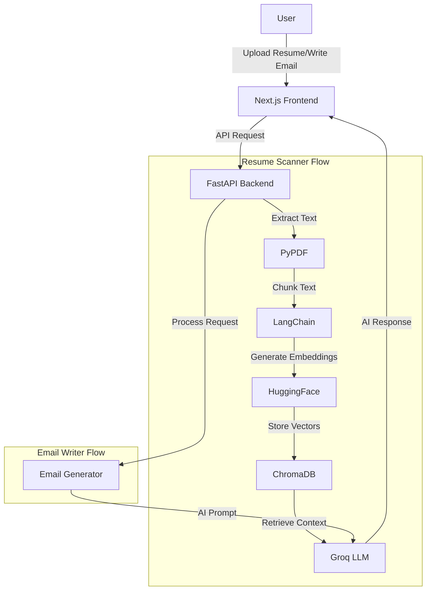

# 📄 JobAI – AI-Powered Resume & Email Assistant Platform

<div align="center">


**An intelligent AI-powered platform with Resume Scanner and Professional Email Writer built with FastAPI, LangChain, Groq LLM, and Next.js**

[](https://fastapi.tiangolo.com/)
[](https://nextjs.org/)
[](https://www.langchain.com/)
[](https://groq.com/)

[Live Demo](#) • [Report Bug](https://github.com/prateekmtri/Resume-Scanner/issues) • [Request Feature](https://github.com/prateekmtri/Resume-Scanner/issues)

</div>

---

## 🌟 Overview

JobAI is a comprehensive career assistance platform that combines **Resume Scanner** and **Email Writer** tools. Using **Retrieval-Augmented Generation (RAG)** and advanced AI, it provides intelligent resume analysis and generates professional job application emails. Perfect for students, job seekers, and recruiters looking to leverage AI for career advancement.

### ✨ Key Features

#### 📄 Resume Scanner
- 📤 **Upload Resume** - Support for PDF format
- 🤖 **AI-Powered Analysis** - Intelligent skill extraction and profiling
- 📊 **Experience Summary** - Automated career progression analysis
- 🎯 **RAG Architecture** - Context-aware understanding using vector embeddings
- 💡 **Actionable Feedback** - Personalized recommendations for improvement

#### ✉️ Email Writer
- ✍️ **Professional Email Generation** - AI-crafted job application emails
- 🎨 **Customizable Tone** - Choose between Professional, Friendly, or Formal
- 📏 **Adjustable Length** - Short, Medium, or Long format options
- ⚡ **Instant Generation** - Get perfectly formatted emails in seconds
- 🎯 **Purpose-Driven** - Tailored for job applications, follow-ups, and HR communication

#### ⚡ Core Technology
- 🚀 **Lightning Fast** - Powered by Groq LLaMA 3.3 (70B parameters)
- 🎨 **Modern UI** - Beautiful Next.js interface with Tailwind CSS
- 🔒 **Secure & Private** - Your data stays protected

---

## 🏗️ Architecture



### 🔄 How It Works

#### Resume Scanner Flow
1. **Upload** → User uploads resume (PDF format)
2. **Extract** → Resume converted to text using PyPDF
3. **Chunk** → Text split into semantic chunks
4. **Embed** → Chunks converted to vector embeddings
5. **Store** → Vectors stored in ChromaDB
6. **Query** → User query sent to Groq LLM
7. **Retrieve** → Relevant chunks retrieved from vector DB
8. **Generate** → AI generates detailed feedback

#### Email Writer Flow
1. **Input** → User provides email purpose and position details
2. **Customize** → Select tone (Professional/Friendly/Formal) and length
3. **Generate** → AI crafts personalized professional email
4. **Review** → User reviews and copies the generated email
5. **Send** → Ready-to-send professional job application email

---

## 🛠️ Tech Stack

<table>
<tr>
<td valign="top" width="50%">

### Backend
- **Framework:** FastAPI
- **LLM:** Groq (LLaMA 3.3 70B)
- **RAG Framework:** LangChain
- **Vector Database:** ChromaDB
- **Embeddings:** HuggingFace (all-MiniLM-L6-v2)
- **PDF Parser:** PyPDF
- **Email Generation:** Custom AI Pipeline

</td>
<td valign="top" width="50%">

### Frontend
- **Framework:** Next.js 14
- **Styling:** Tailwind CSS
- **Language:** JavaScript/TypeScript
- **HTTP Client:** Axios
- **UI Components:** Custom React Components
- **State Management:** React Hooks

</td>
</tr>
</table>

---

## 📸 Screenshots

<div align="center">

### 🏠 Home Page


### 📤 Resume Scanner - Upload Interface


### 🤖 Resume Scanner - AI Analysis Results


### ✉️ Email Writer - Professional Email Generation


</div>

---

## 📦 Project Structure

```
JobAI/
├── backend/
│   ├── main.py                    # FastAPI application
│   ├── langchain_pipeline.py      # RAG pipeline logic
│   ├── email_generator.py         # Email generation module
│   ├── requirements.txt           # Python dependencies
│   ├── .env                       # Environment variables
│   ├── chroma_db/                 # Vector database storage
│   └── utils/                     # Helper functions
│
├── frontend/
│   ├── pages/                     # Next.js pages
│   │   ├── index.js              # Home page
│   │   ├── resume-scanner.js     # Resume Scanner page
│   │   ├── email-writer.js       # Email Writer page
│   │   └── api/                  # API routes
│   ├── components/               # React components
│   │   ├── ResumeUpload.js
│   │   ├── EmailForm.js
│   │   └── ResultDisplay.js
│   ├── styles/                   # CSS/Tailwind styles
│   └── public/
│       └── screenshots/          # Project screenshots
│
├── .gitignore
└── README.md
```

---

## 🚀 Getting Started

### Prerequisites

- Python 3.9+
- Node.js 18+
- npm or yarn
- Groq API Key ([Get it here](https://console.groq.com/))

### 1️⃣ Clone Repository

```bash
git clone https://github.com/prateekmtri/Resume-Scanner.git
cd Resume-Scanner
```

### 2️⃣ Backend Setup

```bash
# Navigate to backend
cd backend

# Create virtual environment
python -m venv venv

# Activate virtual environment
# Windows:
venv\Scripts\activate
# macOS/Linux:
source venv/bin/activate

# Install dependencies
pip install -r requirements.txt
```

**Configure Environment Variables:**

Create `.env` file in `backend/` directory:

```env
GROQ_API_KEY=your_groq_api_key_here
```

**Run Backend Server:**

```bash
uvicorn main:app --reload
```

Backend runs at: `http://127.0.0.1:8000` 🎉

### 3️⃣ Frontend Setup

```bash
# Open new terminal and navigate to frontend
cd frontend

# Install dependencies
npm install

# Run development server
npm run dev
```

Frontend runs at: `http://localhost:3000` 🎉

---

## 🔌 API Documentation

### Resume Scanner Endpoints

#### Upload Resume

**POST** `/upload/`

Upload a PDF resume and receive AI-generated feedback.

**Request:**
- Method: `POST`
- Content-Type: `multipart/form-data`
- Body: `file` (PDF format)

**Response:**

```json
{
  "feedback": "Your resume demonstrates strong technical skills in React, FastAPI, and backend development. Key strengths include: 1) Diverse tech stack experience with modern frameworks, 2) Clear project descriptions showing problem-solving abilities, 3) Quantifiable achievements. Recommendations: Consider adding more metrics to quantify impact, expand on leadership experiences, and include specific technologies used in each project.",
  "status": "success",
  "timestamp": "2025-01-15T10:30:00Z"
}
```

### Email Writer Endpoints

#### Generate Email

**POST** `/generate-email/`

Generate a professional job application email based on user input.

**Request:**
- Method: `POST`
- Content-Type: `application/json`
- Body:
```json
{
  "purpose": "Job application for Senior Software Engineer position",
  "position": "Senior Software Engineer",
  "company": "Tech Corp",
  "tone": "professional",
  "length": "medium"
}
```

**Response:**

```json
{
  "email": "Subject: Application for Senior Software Engineer Position\n\nDear Hiring Manager,\n\nI am writing to express my strong interest in the Senior Software Engineer position at Tech Corp...",
  "status": "success",
  "timestamp": "2025-01-15T10:35:00Z"
}
```

**Interactive API Docs:** Visit `http://127.0.0.1:8000/docs` for Swagger UI

---

## 🧠 AI Models & Technologies

| Component | Technology | Purpose |
|-----------|-----------|---------|
| **LLM** | Groq LLaMA 3.3 (70B) | Resume analysis & email generation |
| **Embeddings** | all-MiniLM-L6-v2 | Text vectorization |
| **Vector DB** | ChromaDB | Efficient similarity search |
| **Framework** | LangChain | RAG pipeline orchestration |
| **Email AI** | Custom Prompt Engineering | Professional email crafting |

---

## 🎯 Use Cases

### For Job Seekers
- ✅ Get instant AI feedback on your resume
- ✅ Generate professional job application emails
- ✅ Save time on email composition
- ✅ Improve your chances of getting noticed

### For Students
- ✅ Learn what makes a strong resume
- ✅ Practice professional communication
- ✅ Prepare for internship applications
- ✅ Build career readiness skills

### For Recruiters
- ✅ Quickly assess candidate resumes
- ✅ Generate professional responses
- ✅ Streamline communication workflow
- ✅ Maintain consistent messaging

---

## 🌟 Why This Project Stands Out

✅ **Dual AI Tools** - Complete career assistance in one platform  
✅ **Production-Ready RAG Architecture** - Implements industry-standard vector search  
✅ **Ultra-Fast Inference** - Groq provides 10x faster responses than traditional LLMs  
✅ **Full-Stack AI Application** - Complete end-to-end implementation  
✅ **Real-World Use Case** - Solves actual problems for job seekers  
✅ **Portfolio-Grade Project** - Demonstrates advanced AI/ML skills  
✅ **Scalable Design** - Built with modern, maintainable architecture  
✅ **Professional UI/UX** - Polished interface with excellent user experience

**Perfect for demonstrating to recruiters and building your AI portfolio!** 💼

---

## 🚀 Future Enhancements

- [ ] Resume template suggestions
- [ ] Multi-language email support
- [ ] Email history and templates
- [ ] LinkedIn profile optimization
- [ ] Cover letter generation
- [ ] Interview preparation assistant
- [ ] Job matching recommendations
- [ ] Resume ATS optimization score

---

## 🤝 Contributing

Contributions, issues, and feature requests are welcome!

1. Fork the Project
2. Create your Feature Branch (`git checkout -b feature/AmazingFeature`)
3. Commit your Changes (`git commit -m 'Add some AmazingFeature'`)
4. Push to the Branch (`git push origin feature/AmazingFeature`)
5. Open a Pull Request

---

## 📝 License

This project is licensed under the MIT License - see the [LICENSE](LICENSE) file for details.

---

## 👤 Author

**Prateek Mani Tripathi**  
*MERN + AI Developer*

- 🌐 GitHub: [@prateekmtri](https://github.com/prateekmtri)
- 📧 Email: prateek1tri2@gmail.com
- 💼 LinkedIn: [Connect with me](https://linkedin.com/in/prateekmtri)

---

## 🙏 Acknowledgments

- [Groq](https://groq.com/) for lightning-fast LLM inference
- [LangChain](https://www.langchain.com/) for RAG framework
- [FastAPI](https://fastapi.tiangolo.com/) for robust backend
- [Next.js](https://nextjs.org/) for excellent frontend framework

---

## ⭐ Show Your Support

If you found this project helpful, please give it a **star** ⭐  
It motivates me to build more AI-powered tools!

<div align="center">

### Made with ❤️ and AI

**JobAI - Empowering Your Career Journey with Artificial Intelligence**

</div>