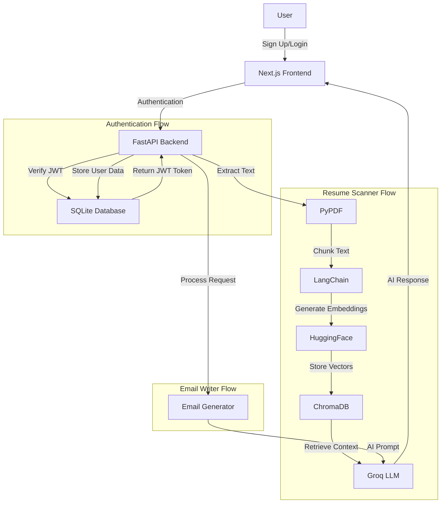
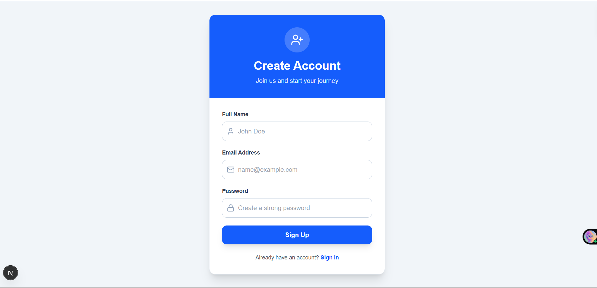
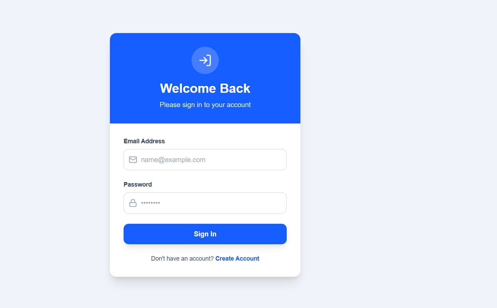
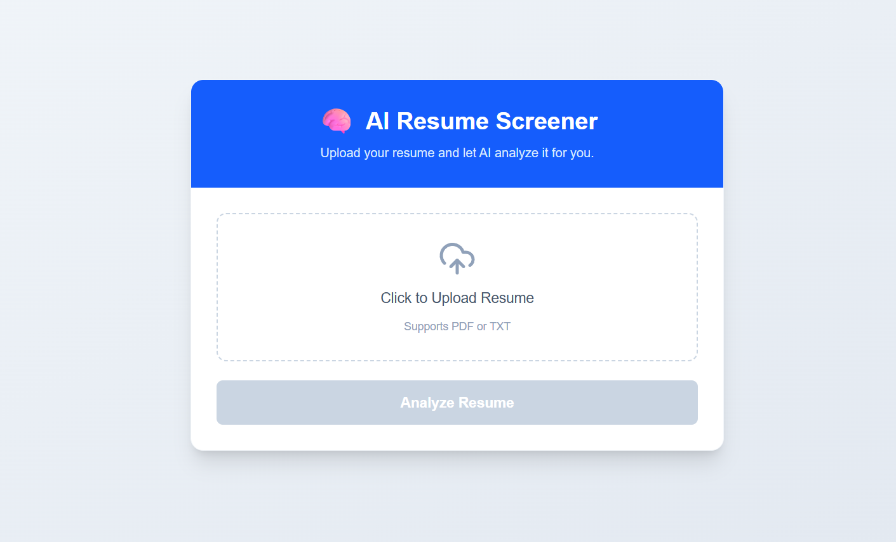
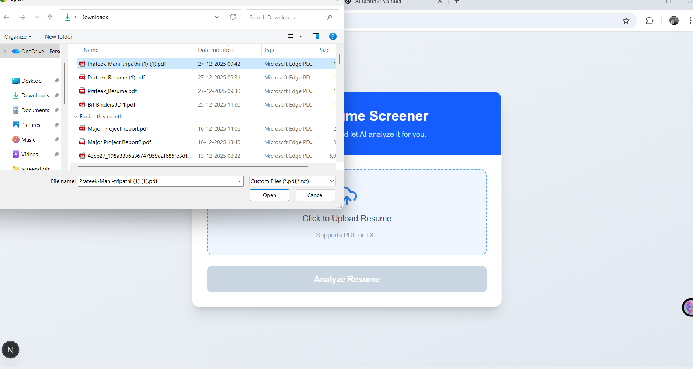
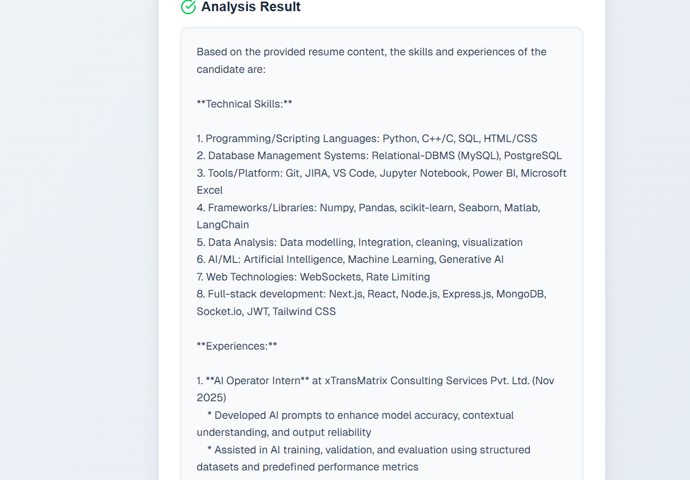
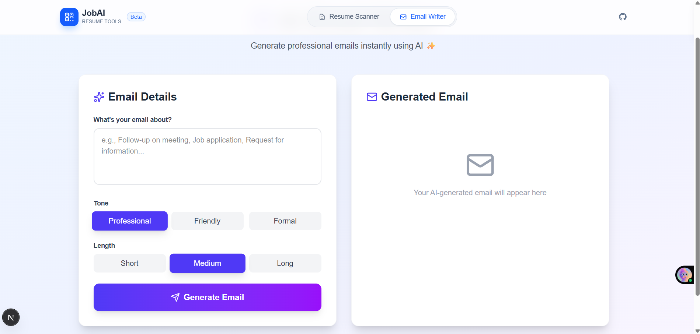

# 📄 JobAI – AI-Powered Resume & Email Assistant Platform

<div align="center">


**A full-stack intelligent AI-powered platform with Authentication, Resume Scanner, and Professional Email Writer built with FastAPI, LangChain, Groq LLM, Next.js, and SQLite**

[](https://fastapi.tiangolo.com/)
[](https://nextjs.org/)
[](https://www.langchain.com/)
[](https://groq.com/)
[](https://www.sqlite.org/)

[Live Demo](#) • [Report Bug](https://github.com/prateekmtri/Resume-Scanner/issues) • [Request Feature](https://github.com/prateekmtri/Resume-Scanner/issues)

</div>

---

## 🌟 Overview

JobAI is a **production-ready**, full-stack career assistance platform that combines **User Authentication**, **Resume Scanner**, and **Email Writer** tools. Using **Retrieval-Augmented Generation (RAG)** and advanced AI, it provides secure, intelligent resume analysis and generates professional job application emails. Perfect for students, job seekers, and recruiters looking to leverage AI for career advancement.

### ✨ Key Features

#### 🔐 User Authentication
- 🔒 **Secure Sign Up & Login** - JWT-based authentication
- 👤 **User Profiles** - Personalized user experience
- 🗄️ **SQLite Database** - Reliable data persistence
- 🛡️ **Protected Routes** - Secure access to AI features

#### 📄 Resume Scanner
- 📤 **Upload Resume** - Support for PDF format
- 🤖 **AI-Powered Analysis** - Intelligent skill extraction and profiling
- 📊 **Experience Summary** - Automated career progression analysis
- 🎯 **RAG Architecture** - Context-aware understanding using vector embeddings
- 💡 **Actionable Feedback** - Personalized recommendations for improvement

#### ✉️ Email Writer
- ✍️ **Professional Email Generation** - AI-crafted job application emails
- 🎨 **Customizable Tone** - Choose between Professional, Friendly, or Formal
- 📏 **Adjustable Length** - Short, Medium, or Long format options
- ⚡ **Instant Generation** - Get perfectly formatted emails in seconds
- 🎯 **Purpose-Driven** - Tailored for job applications, follow-ups, and HR communication

#### ⚡ Core Technology
- 🚀 **Lightning Fast** - Powered by Groq LLaMA 3.3 (70B parameters)
- 🎨 **Modern UI** - Beautiful Next.js interface with Tailwind CSS
- 🔒 **Secure & Private** - Your data stays protected with authentication

---

## 🏗️ Architecture



### 🔄 How It Works

#### Authentication Flow
1. **Sign Up** → User creates account with credentials
2. **Store** → User data saved in SQLite database
3. **Login** → User authenticates with email/password
4. **JWT Token** → Server generates and returns JWT token
5. **Protected Access** → Token required for Resume Scanner & Email Writer

#### Resume Scanner Flow
1. **Upload** → Authenticated user uploads resume (PDF format)
2. **Extract** → Resume converted to text using PyPDF
3. **Chunk** → Text split into semantic chunks
4. **Embed** → Chunks converted to vector embeddings
5. **Store** → Vectors stored in ChromaDB
6. **Query** → User query sent to Groq LLM
7. **Retrieve** → Relevant chunks retrieved from vector DB
8. **Generate** → AI generates detailed feedback

#### Email Writer Flow
1. **Input** → Authenticated user provides email topic and preferences
2. **Customize** → Select tone (Professional/Friendly/Formal) and length
3. **Generate** → AI crafts personalized professional email
4. **Review** → User reviews and copies the generated email
5. **Send** → Ready-to-send professional job application email

---

## 🛠️ Tech Stack

<table>
<tr>
<td valign="top" width="50%">

### Backend
- **Framework:** FastAPI
- **Database:** SQLite
- **Authentication:** JWT (JSON Web Tokens)
- **LLM:** Groq (LLaMA 3.3 70B)
- **RAG Framework:** LangChain
- **Vector Database:** ChromaDB
- **Embeddings:** HuggingFace (all-MiniLM-L6-v2)
- **PDF Parser:** PyPDF
- **Email Generation:** Custom AI Pipeline
- **Architecture:** Clean layered architecture (API, Services, Models, Schemas)

</td>
<td valign="top" width="50%">

### Frontend
- **Framework:** Next.js 14
- **Styling:** Tailwind CSS
- **Language:** JavaScript/TypeScript
- **HTTP Client:** Fetch API
- **UI Components:** Custom React Components
- **State Management:** React Hooks
- **Authentication UI:** Custom Login/Signup Forms
- **Protected Routes:** Next.js Middleware

</td>
</tr>
</table>

---

## 📸 Screenshots

<div align="center">

### 🔐 Authentication - Sign Up

*Secure user registration with clean, modern UI*

### 🔑 Authentication - Login

*Simple and secure login interface*

### 🏠 Home Page

*Landing page with feature overview*

### 📤 Resume Scanner - Upload Interface

*Drag-and-drop resume upload with real-time processing*

### 🤖 Resume Scanner - AI Analysis Results

*Comprehensive AI-powered resume feedback*

### ✉️ Email Writer - Professional Email Generation

*Intelligent email generation with customizable options*

</div>

---

## 📦 Project Structure

```
JobAI/
├── backend/
│   ├── app/
│   │   ├── api/
│   │   │   ├── __init__.py
│   │   │   └── v1/
│   │   │       ├── __init__.py
│   │   │       └── endpoints/
│   │   │           ├── __init__.py
│   │   │           ├── auth.py              # Authentication endpoints
│   │   │           ├── resume.py            # Resume upload endpoint
│   │   │           └── email.py             # Email generation endpoint
│   │   │
│   │   ├── core/                            # Core configurations
│   │   │   ├── __init__.py
│   │   │   ├── security.py                  # JWT & password hashing
│   │   │   └── config.py                    # App configuration
│   │   │
│   │   ├── db/                              # Database utilities
│   │   │   ├── __init__.py
│   │   │   ├── database.py                  # SQLite connection
│   │   │   └── session.py                   # Database sessions
│   │   │
│   │   ├── langchain/                       # LangChain modules
│   │   │   ├── __init__.py
│   │   │   └── resume_analyzer.py           # RAG pipeline logic
│   │   │
│   │   ├── models/                          # Database models
│   │   │   ├── __init__.py
│   │   │   └── user.py                      # User model (SQLAlchemy)
│   │   │
│   │   ├── schemas/                         # Pydantic schemas
│   │   │   ├── __init__.py
│   │   │   ├── user.py                      # User request/response schemas
│   │   │   └── email.py                     # Email request/response schemas
│   │   │
│   │   ├── services/                        # Business logic
│   │   │   ├── __init__.py
│   │   │   ├── auth_service.py              # Authentication logic
│   │   │   ├── resume_service.py            # Resume processing service
│   │   │   └── email_service.py             # Email generation service
│   │   │
│   │   ├── __init__.py
│   │   └── main.py                          # FastAPI application entry
│   │
│   ├── temp/                                # Temporary file storage
│   ├── chroma_db/                           # Vector database storage
│   ├── jobai.db                             # SQLite database file
│   ├── requirements.txt                     # Python dependencies
│   └── .env                                 # Environment variables
│
├── frontend/
│   ├── app/
│   │   ├── authentication/                  # Authentication pages
│   │   │   ├── login/
│   │   │   │   └── page.js                 # Login page
│   │   │   └── signup/
│   │   │       └── page.js                 # Sign up page
│   │   │
│   │   ├── components/                      # React components
│   │   │   ├── Navbar.js                   # Navigation bar
│   │   │   ├── ProtectedRoute.js           # Route protection
│   │   │   └── AuthForm.js                 # Reusable auth form
│   │   │
│   │   ├── email-writer/
│   │   │   └── page.js                     # Email Writer page
│   │   │
│   │   ├── resume-screener/
│   │   │   └── page.js                     # Resume Scanner page
│   │   │
│   │   ├── favicon.ico
│   │   ├── globals.css                      # Global styles
│   │   ├── layout.js                        # Root layout
│   │   └── page.js                          # Home page
│   │
│   ├── node_modules/                        # Dependencies
│   ├── public/
│   │   └── screenshots/                     # Project screenshots
│   │
│   ├── .env
│   ├── .gitignore
│   ├── jsconfig.json
│   ├── next.config.mjs
│   ├── package-lock.json
│   ├── package.json
│   ├── postcss.config.mjs
│   └── README.md
│
├── venv/                                    # Python virtual environment
├── .env
├── .gitignore
└── README.md                                # This file
```

---

## 🚀 Getting Started

### Prerequisites

- Python 3.9+
- Node.js 18+
- npm or yarn
- Groq API Key ([Get it here](https://console.groq.com/))

### 1️⃣ Clone Repository

```bash
git clone https://github.com/prateekmtri/Resume-Scanner.git
cd Resume-Scanner
```

### 2️⃣ Backend Setup

```bash
# Navigate to backend
cd backend

# Create virtual environment
python -m venv venv

# Activate virtual environment
# Windows:
venv\Scripts\activate
# macOS/Linux:
source venv/bin/activate

# Install dependencies
pip install -r requirements.txt

# Install LangChain HuggingFace (for embeddings)
pip install -U langchain-huggingface
```

**Configure Environment Variables:**

Create `.env` file in `backend/` directory:

```env
# Groq API Configuration
GROQ_API_KEY=your_groq_api_key_here

# JWT Secret Key (generate a strong random key)
SECRET_KEY=your_super_secret_jwt_key_here
ALGORITHM=HS256
ACCESS_TOKEN_EXPIRE_MINUTES=30

# Database Configuration
DATABASE_URL=sqlite:///./jobai.db
```

**Create Required Folders:**

```bash
# Create temp folder for file uploads
mkdir temp

# ChromaDB and SQLite database folders will be created automatically
```

**Initialize Database:**

```bash
# Run the application once to create database tables
python -m app.main
```

**Run Backend Server:**

```bash
uvicorn app.main:app --reload
```

Backend runs at: `http://127.0.0.1:8000` 🎉

### 3️⃣ Frontend Setup

```bash
# Open new terminal and navigate to frontend
cd frontend

# Install dependencies
npm install

# Configure environment variables
# Create .env.local file in frontend directory
echo "NEXT_PUBLIC_API_URL=http://127.0.0.1:8000" > .env.local

# Run development server
npm run dev
```

Frontend runs at: `http://localhost:3000` 🎉

---

## 🔌 API Documentation

### Authentication Endpoints

#### Sign Up

**POST** `/api/v1/auth/signup`

Create a new user account.

**Request:**
```json
{
  "email": "user@example.com",
  "password": "SecurePassword123",
  "full_name": "John Doe"
}
```

**Response:**
```json
{
  "access_token": "eyJhbGciOiJIUzI1NiIsInR5cCI6IkpXVCJ9...",
  "token_type": "bearer",
  "user": {
    "id": 1,
    "email": "user@example.com",
    "full_name": "John Doe"
  }
}
```

#### Login

**POST** `/api/v1/auth/login`

Authenticate existing user.

**Request:**
```json
{
  "email": "user@example.com",
  "password": "SecurePassword123"
}
```

**Response:**
```json
{
  "access_token": "eyJhbGciOiJIUzI1NiIsInR5cCI6IkpXVCJ9...",
  "token_type": "bearer",
  "user": {
    "id": 1,
    "email": "user@example.com",
    "full_name": "John Doe"
  }
}
```

### Resume Scanner Endpoints

#### Upload Resume

**POST** `/api/v1/resume/upload`

Upload a PDF resume and receive AI-generated feedback. **Requires Authentication.**

**Headers:**
```
Authorization: Bearer <your_jwt_token>
```

**Request:**
- Method: `POST`
- Content-Type: `multipart/form-data`
- Body: `file` (PDF format)

**Response:**

```json
{
  "feedback": "Your resume demonstrates strong technical skills in React, FastAPI, and backend development. Key strengths include: 1) Diverse tech stack experience with modern frameworks, 2) Clear project descriptions showing problem-solving abilities, 3) Quantifiable achievements. Recommendations: Consider adding more metrics to quantify impact, expand on leadership experiences, and include specific technologies used in each project."
}
```

**cURL Example:**

```bash
curl -X POST "http://127.0.0.1:8000/api/v1/resume/upload" \
  -H "Authorization: Bearer your_jwt_token_here" \
  -H "accept: application/json" \
  -H "Content-Type: multipart/form-data" \
  -F "file=@resume.pdf"
```

### Email Writer Endpoints

#### Generate Email

**POST** `/api/v1/email/generate`

Generate a professional job application email. **Requires Authentication.**

**Headers:**
```
Authorization: Bearer <your_jwt_token>
```

**Request:**
- Method: `POST`
- Content-Type: `application/json`
- Body:
```json
{
  "topic": "Application for Senior Software Engineer position at Tech Corp",
  "tone": "professional",
  "length": "medium"
}
```

**Response:**

```json
{
  "email": "Dear Hiring Manager,\n\nI am writing to express my strong interest in the Senior Software Engineer position at Tech Corp...",
  "subject": "Application for Senior Software Engineer Position"
}
```

**cURL Example:**

```bash
curl -X POST "http://127.0.0.1:8000/api/v1/email/generate" \
  -H "Authorization: Bearer your_jwt_token_here" \
  -H "Content-Type: application/json" \
  -d '{
    "topic": "Application for Senior Software Engineer",
    "tone": "professional",
    "length": "medium"
  }'
```

**Interactive API Docs:** Visit `http://127.0.0.1:8000/docs` for Swagger UI

---

## 🔐 Security Features

### Authentication & Authorization
- **JWT Tokens:** Secure token-based authentication
- **Password Hashing:** bcrypt algorithm for secure password storage
- **Protected Routes:** All AI features require authentication
- **Token Expiration:** Configurable token expiry time

### Data Security
- **SQLite Database:** Reliable local data persistence
- **Encrypted Passwords:** Never store plain-text passwords
- **Secure File Handling:** Temporary file storage with cleanup
- **CORS Protection:** Configured CORS policies

---

## 🧠 AI Models & Technologies

| Component | Technology | Purpose |
|-----------|-----------|---------|
| **LLM** | Groq LLaMA 3.3 (70B) | Resume analysis & email generation |
| **Embeddings** | all-MiniLM-L6-v2 (HuggingFace) | Text vectorization |
| **Vector DB** | ChromaDB | Efficient similarity search |
| **Framework** | LangChain | RAG pipeline orchestration |
| **Email AI** | Custom Prompt Engineering | Professional email crafting |
| **Database** | SQLite | User data persistence |
| **Authentication** | JWT | Secure user authentication |

---

## 🎯 Use Cases

### For Job Seekers
- ✅ Create secure account to save progress
- ✅ Get instant AI feedback on your resume
- ✅ Generate professional job application emails
- ✅ Save time on email composition
- ✅ Improve your chances of getting noticed

### For Students
- ✅ Learn what makes a strong resume
- ✅ Practice professional communication
- ✅ Prepare for internship applications
- ✅ Build career readiness skills
- ✅ Track your resume improvements over time

### For Recruiters
- ✅ Quickly assess candidate resumes
- ✅ Generate professional responses
- ✅ Streamline communication workflow
- ✅ Maintain consistent messaging
- ✅ Manage multiple candidate interactions

---

## 🌟 Why This Project Stands Out

✅ **Full-Stack Production Application** - Complete authentication system with database  
✅ **Production-Grade Architecture** - Clean separation of concerns with layered structure  
✅ **Secure Authentication** - JWT-based auth with password hashing  
✅ **Database Integration** - SQLite for reliable data persistence  
✅ **Dual AI Tools** - Complete career assistance in one platform  
✅ **Advanced RAG Implementation** - Industry-standard vector search with ChromaDB  
✅ **Ultra-Fast Inference** - Groq provides 10x faster responses than traditional LLMs  
✅ **Scalable Design** - Modular structure with API versioning (v1)  
✅ **Real-World Use Case** - Solves actual problems for job seekers  
✅ **Portfolio-Grade Project** - Demonstrates full-stack AI/ML & software engineering skills  
✅ **Professional UI/UX** - Polished interface with excellent user experience

**Perfect for demonstrating to recruiters and building your AI portfolio!** 💼

---

## 🚀 Future Enhancements

- [ ] User dashboard with analytics
- [ ] Resume history and version tracking
- [ ] Email template library
- [ ] Multi-language email support
- [ ] LinkedIn profile optimization
- [ ] Cover letter generation
- [ ] Interview preparation assistant
- [ ] Job matching recommendations
- [ ] Resume ATS optimization score
- [ ] PostgreSQL/MySQL integration
- [ ] OAuth integration (Google, GitHub)
- [ ] Email scheduling and tracking
- [ ] Resume comparison tool
- [ ] Collaborative resume reviews

---

## 🤝 Contributing

Contributions, issues, and feature requests are welcome!

1. Fork the Project
2. Create your Feature Branch (`git checkout -b feature/AmazingFeature`)
3. Commit your Changes (`git commit -m 'Add some AmazingFeature'`)
4. Push to the Branch (`git push origin feature/AmazingFeature`)
5. Open a Pull Request

---

## 📝 License

This project is licensed under the MIT License - see the [LICENSE](LICENSE) file for details.

---

## 👤 Author

**Prateek Mani Tripathi**  
*Full-Stack MERN + AI Developer*

- 🌐 GitHub: [@prateekmtri](https://github.com/prateekmtri)
- 📧 Email: prateek1tri2@gmail.com
- 💼 LinkedIn: [Connect with me](https://linkedin.com/in/prateekmtri)
- 🚀 Portfolio: https://new-advance-portfolio.vercel.app/

---

## 🙏 Acknowledgments

- [Groq](https://groq.com/) for lightning-fast LLM inference
- [LangChain](https://www.langchain.com/) for RAG framework
- [FastAPI](https://fastapi.tiangolo.com/) for robust backend
- [Next.js](https://nextjs.org/) for excellent frontend framework
- [SQLite](https://www.sqlite.org/) for reliable database

---

## ⭐ Show Your Support

If you found this project helpful, please give it a **star** ⭐  
It motivates me to build more AI-powered tools!

<div align="center">

### Made with ❤️ and AI

**JobAI - Empowering Your Career Journey with Artificial Intelligence**


</div>