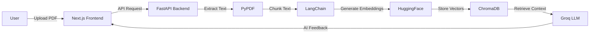

# 📄 Resume Scanner – AI-Powered Resume Analysis Platform

<div align="center">


**An intelligent AI-powered Resume Scanner built with FastAPI, LangChain, Groq LLM, and Next.js**

[](https://fastapi.tiangolo.com/)
[](https://nextjs.org/)
[](https://www.langchain.com/)
[](https://groq.com/)

[Live Demo](#) • [Report Bug](https://github.com/prateekmtri/Resume-Scanner/issues) • [Request Feature](https://github.com/prateekmtri/Resume-Scanner/issues)

</div>

---

## 🌟 Overview

Resume Scanner uses **Retrieval-Augmented Generation (RAG)** to deeply analyze resumes and provide actionable insights on skills, experience, and job fit. Built for students, job seekers, and recruiters to leverage AI for instant resume feedback.

### ✨ Key Features

- 📤 **Upload Resume** - Support for PDF format
- 🤖 **AI-Powered Analysis** - Intelligent skill extraction and profiling
- 📊 **Experience Summary** - Automated career progression analysis
- 🎯 **RAG Architecture** - Context-aware understanding using vector embeddings
- ⚡ **Lightning Fast** - Powered by Groq LLaMA 3.3 (70B parameters)
- 🎨 **Modern UI** - Beautiful Next.js interface with Tailwind CSS

---

## 🏗️ Architecture



### 🔄 How It Works

1. **Upload** → User uploads resume (PDF format)
2. **Extract** → Resume converted to text using PyPDF
3. **Chunk** → Text split into semantic chunks
4. **Embed** → Chunks converted to vector embeddings
5. **Store** → Vectors stored in ChromaDB
6. **Query** → User query sent to Groq LLM
7. **Retrieve** → Relevant chunks retrieved from vector DB
8. **Generate** → AI generates detailed feedback

---

## 🛠️ Tech Stack

<table>
<tr>
<td valign="top" width="50%">

### Backend
- **Framework:** FastAPI
- **LLM:** Groq (LLaMA 3.3 70B)
- **RAG Framework:** LangChain
- **Vector Database:** ChromaDB
- **Embeddings:** HuggingFace (all-MiniLM-L6-v2)
- **PDF Parser:** PyPDF

</td>
<td valign="top" width="50%">

### Frontend
- **Framework:** Next.js 14
- **Styling:** Tailwind CSS
- **Language:** JavaScript/TypeScript
- **HTTP Client:** Axios
- **UI Components:** Custom React Components

</td>
</tr>
</table>

---

## 📸 Screenshots

<div align="center">

### 🏠 Home Page


### 📤 Resume Upload


### 🤖 AI Analysis Results


</div>

---

## 📦 Project Structure

```
Resume-Scanner/
├── backend/
│   ├── main.py                    # FastAPI application
│   ├── langchain_pipeline.py      # RAG pipeline logic
│   ├── requirements.txt           # Python dependencies
│   ├── .env                       # Environment variables
│   ├── chroma_db/                 # Vector database storage
│   └── utils/                     # Helper functions
│
├── frontend/
│   ├── pages/                     # Next.js pages
│   │   ├── index.js              # Home page
│   │   └── api/                  # API routes
│   ├── components/               # React components
│   ├── styles/                   # CSS/Tailwind styles
│   └── public/
│       └── screenshots/          # Project screenshots
│
├── .gitignore
└── README.md
```

---

## 🚀 Getting Started

### Prerequisites

- Python 3.9+
- Node.js 18+
- npm or yarn
- Groq API Key ([Get it here](https://console.groq.com/))

### 1️⃣ Clone Repository

```bash
git clone https://github.com/prateekmtri/Resume-Scanner.git
cd Resume-Scanner
```

### 2️⃣ Backend Setup

```bash
# Navigate to backend
cd backend

# Create virtual environment
python -m venv venv

# Activate virtual environment
# Windows:
venv\Scripts\activate
# macOS/Linux:
source venv/bin/activate

# Install dependencies
pip install -r requirements.txt
```

**Configure Environment Variables:**

Create `.env` file in `backend/` directory:

```env
GROQ_API_KEY=your_groq_api_key_here
```

**Run Backend Server:**

```bash
uvicorn main:app --reload
```

Backend runs at: `http://127.0.0.1:8000` 🎉

### 3️⃣ Frontend Setup

```bash
# Open new terminal and navigate to frontend
cd frontend

# Install dependencies
npm install

# Run development server
npm run dev
```

Frontend runs at: `http://localhost:3000` 🎉

---

## 🔌 API Documentation

### Upload Resume Endpoint

**POST** `/upload/`

Upload a PDF resume and receive AI-generated feedback.

**Request:**
- Method: `POST`
- Content-Type: `multipart/form-data`
- Body: `file` (PDF format)

**Response:**

```json
{
  "feedback": "Your resume demonstrates strong technical skills in React, FastAPI, and backend development. Key strengths include: 1) Diverse tech stack experience with modern frameworks, 2) Clear project descriptions showing problem-solving abilities, 3) Quantifiable achievements. Recommendations: Consider adding more metrics to quantify impact, expand on leadership experiences, and include specific technologies used in each project.",
  "status": "success",
  "timestamp": "2025-01-15T10:30:00Z"
}
```

**Interactive API Docs:** Visit `http://127.0.0.1:8000/docs` for Swagger UI

---

## 🧠 AI Models & Technologies

| Component | Technology | Purpose |
|-----------|-----------|---------|
| **LLM** | Groq LLaMA 3.3 (70B) | Resume analysis & feedback generation |
| **Embeddings** | all-MiniLM-L6-v2 | Text vectorization |
| **Vector DB** | ChromaDB | Efficient similarity search |
| **Framework** | LangChain | RAG pipeline orchestration |

---

## 🌟 Why This Project Stands Out

✅ **Production-Ready RAG Architecture** - Implements industry-standard vector search  
✅ **Ultra-Fast Inference** - Groq provides 10x faster responses than traditional LLMs  
✅ **Full-Stack AI Application** - Complete end-to-end implementation  
✅ **Real-World Use Case** - Solves actual problems for job seekers  
✅ **Portfolio-Grade Project** - Demonstrates advanced AI/ML skills  
✅ **Scalable Design** - Built with modern, maintainable architecture

**Perfect for demonstrating to recruiters and building your AI portfolio!** 💼

---

## 🤝 Contributing

Contributions, issues, and feature requests are welcome!

1. Fork the Project
2. Create your Feature Branch (`git checkout -b feature/AmazingFeature`)
3. Commit your Changes (`git commit -m 'Add some AmazingFeature'`)
4. Push to the Branch (`git push origin feature/AmazingFeature`)
5. Open a Pull Request

---

## 📝 License

This project is licensed under the MIT License - see the [LICENSE](LICENSE) file for details.

---

## 👤 Author

**Prateek Mani Tripathi**  
*MERN + AI Developer*

- 🌐 GitHub: [@prateekmtri](https://github.com/prateekmtri)
- 📧 Email: prateek1tri2@gmail.com


---

## ⭐ Show Your Support

If you found this project helpful, please give it a **star** ⭐  
It motivates me to build more AI-powered tools!

<div align="center">

### Made with ❤️ and AI

</div>